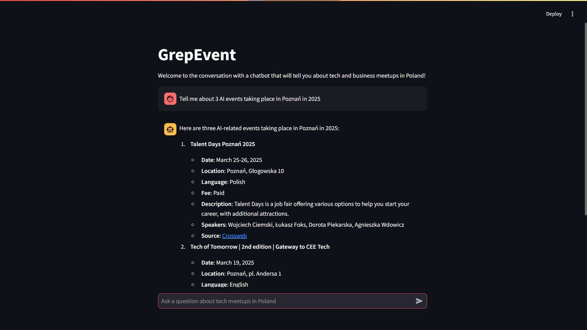

# GrepEvent - Retrieval-Augmented Generation
Chatbot app, where the user asks AI about tech events taking place in Poland.
Created using Python

## Table of contents
* [Introduction](#introduction)
* [Technologies](#technologies)
* [Setup](#setup)
* [Screenshots](#screenshots)
* [Status](#status)
* [Acknowledgements](#acknowledgements)
* [Our team](#our-team)

## Introduction

This is a project that was assigned to us by a [datarabbit.ai](https://www.datarabbit.ai/) company as a recruitment task.
We had to complete it in order to do an internship there.

This task was also an opportunity for us to learn new technologies, 
that we were unfamiliar with at the beginning.

## Technologies

- [Python](https://www.python.org/downloads/) _version: 3.13_, and its libraries:
  - [streamlit](https://docs.streamlit.io/) _version: 1.41.1_
  - [langchain](https://python.langchain.com/docs/introduction/) _version: 0.3_
  - [beautifulsoup](https://pypi.org/project/beautifulsoup4/) _version: 4.12_
  - and many other less important modules listed [here](./requirements.txt) 
- [Docker](https://docs.docker.com/) _version: 27.4_
- [Chroma](https://hub.docker.com/r/chromadb/chroma/tags) docker image _tag: 0.6.4.dev119_

## Setup

In order to run this app, docker is required. 

If you don't have docker installed on your computer yet, you can install it [here](https://docs.docker.com/get-started/get-docker/)

Once you have docker installed, follow these guidelines:
1. Clone the repo on your local machine 
   1. You can do it by running this command in terminal:
      1. ```git clone https://github.com/Rumeleq/ragapp.git```
2. Make sure you are in the project's root folder and run the command:
   1. ```docker-compose up```
   2. By running the above command, docker should:
      1. install the chromadb image (unless you have it already)
      2. run etl container after the chroma's healthcheck
      3. in etl container `scraper.py` script should scrape the data from websites:
         1. [crossweb](https://crossweb.pl/)
         2. [unikonferencje](https://unikonferencje.pl/)
         3. [eventbritte](https://www.eventbrite.com/)
      4. after the `scraper.py` finishes successfully, frontend container should run and expose the port 8501
   3. The whole process could take **even a few minutes**, especially when running for the first time
3. If you see in docker logs that frontend container is starting to run, you can [visit the webapp in browser](http://localhost:8501) 

## Screenshots

Correctly set up and working app looks like this:


## Status

The project is: _in progress_

It is in fact almost done, however it lacks documentation, integration with docker and improvement of internal prompts to AI.

## Acknowledgements

Special thanks to [datarabbit](https://www.datarabbit.ai/) team for giving us this interesting challenge

Many thanks to:
- [Programator](https://www.youtube.com/watch?v=wFcAa28kjVQ&list=PLkcy-k498-V5AmftzfqinpMF2LFqSHK5n) for providing strong understanding of Docker
- [Docker documentation](https://docs.docker.com/manuals/) for vital details about creating `docker-compose.yml` file
- [Streamlit documentation](https://docs.streamlit.io/) for everything about streamlit library
- [ChromaDB Cookbook](https://cookbook.chromadb.dev/running/health-checks/) for configuration of ChromaDB with Docker

## Our team
People and their roles:

[Rumeleq](https://github.com/Rumeleq) - repository owner, responsible for etl scraper

[wiktorKycia](https://github.com/wiktorKycia) - repository maintainer, responsible for frontend - displaying data on a website, also responsible for dockerization

[JanTopolewski](https://github.com/JanTopolewski) - responsible for data flow, connecting to chroma database, prompt templates